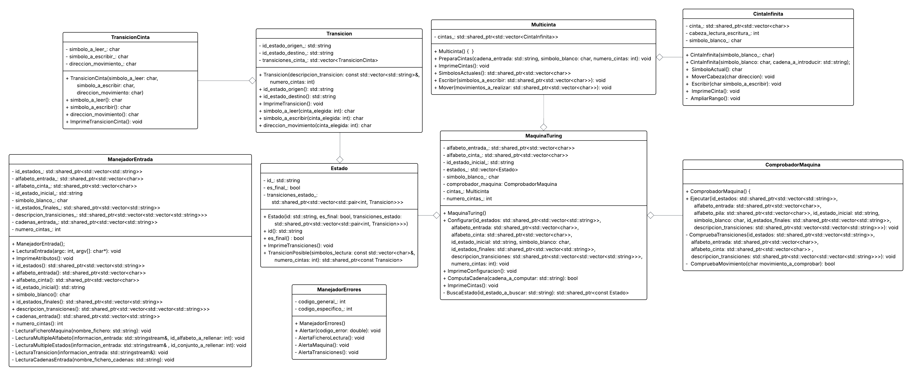

# CC-PR2-Maquina_de_Turing

En este repositorio se alojan los ficheros relacionados con la práctica 2 de Complejidad Computacional.

En este caso, hemos dicidido que las [Máquinas de Turing](https://es.wikipedia.org/wiki/M%C3%A1quina_de_Turing) que creemos para esta práctica sean:

* Movimiento y escritura simultáneos.
* Posibilidad de no mover la cinta.
* Multicinta.
* Cinta infinita en ambas direcciones.

## Consideraciones a tener en cuenta.

### Acceder al repositorio en GitHub.
Para acceder al repositorio de GitHub de esta práctica, puede hacerlo por medio de este [enlace](https://github.com/DiegoHdezChico/CC-PR2-Maquina_de_Turing.git).

---

### Arquitectura del programa.
Para crear el simulador de máquina de Turing, se ha generado un sistema con la siguiente arquitectura:


---

### Compilar y ejecutar.
Para compilar el programa, ejecutar el comando `make`.

Para ejecutar el programa, ejecutar:
```bash
./simulador_maquina_turing -m <instancia_maquina> -f <fichero_cadenas>
```
De este modo:

* `-m <instancia_maquina>`: Se utiliza para especifica el fichero en el cual se encuentra la descripción de la máquina de Turing a simular.
* `-f <fichero_cadenas>`: Se utiliza para especificar el fichero en el cual se hayan las cadenas que queremos que compute nuestra máquina de Turing.

>[!IMPORTANT]
>Se ha de tener en cuenta que es obligatorio pasar al programa un fichero con las cadenas de entrada, en caso contrario, se lanzará un error.

---

## Tabla de errores.
Al igual que en la práctica anterior, este programa lanza las excepciones pertinentes en forma de double, que más tarde es interpretado por el **manejador de errores**. A continuación se muestra la tabla con el significado de cada uno de los códigos.

> [!NOTE]
> Los códigos expresados como número enteros son generales y se lanzarán siempre junto a aquellos con decimales que comparten la parte entera.

| Código de Error | Significado |
| --------------- | ----------- |
| **1**           | Error en la lectura del fichero. |
| 1.1             | No se ha podido abrir el fichero con la descripción de la máquina. |
| 1.2             | Una de las transiciones tiene un número incorrecto de entradas. |
| 1.3             | No se ha especificado un fichero de entrada de cadenas. |
| 1.4             | No se ha encontrado el fichero con las cadenas de entrada. |
| 1.5             | No se ha especificado un número de cintas valido. | 
| **2**           | Error en la configuración de la máquina. |
| 2.1             | El conjunto de estados está vacío. |
| 2.2             | El alfabeto de cinta está vacío. |
| 2.3             | No se ha especificado un estado inicial. |
| 2.4             | No se ha especificado un símbolo blanco. |
| 2.5             | No se ha proporcionado ningún estado final. |
| 2.6             | Se ha incluido estados en el conjunto de estados finales que no pertenecen al conjunto de estados. |
| 2.7             | No se ha introducido un estado inicial válido. |
| 2.8             | El símbolo blanco especificado no pertenece al alfabeto de cinta. |
| **3**           | Error en las transiciones. |
| 3.1             | Una de las transiciones hace uso de más de un caracter de lectura. |
| 3.2             | Una de las transiciones hace uso de más de un caracter de escritura. |
| 3.3             | Una de las transiciones hace uso de más de un caracter para indicar el movimiento de las cintas. |
| 3.4             | Una de las transiciones tiene un estado de origen que no pertenece al conjunto de estados. |
| 3.5             | Una de las transiciones tiene un estado de destino que no pertenece al conjunto de estados. |
| 3.6             | Una de las transiciones trata de leer un símbolo que no pertenece al alfabeto de la cinta. |
| 3.7             | Una de las transiciones trata de escribir un símbolo que no pertenece al alfabeto de la cinta. |
| 3.8             | Una de las transiciones tiene un movimiento que no es valido (R, L, S). |